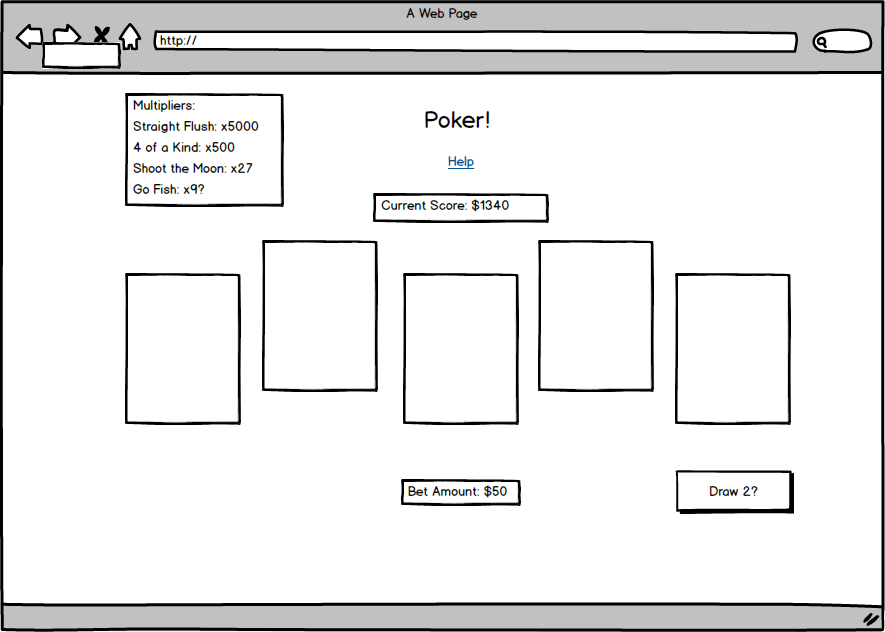

## Single Player 5 Card Draw Poker

### Background

Poker exists in hundreds of variations, but one of the simplest incarnations of this game is 5 Card Draw. A typical round of 5 Card Draw Poker follows these steps:

1) Players are dealt a hand of 5 cards.
2) A round of betting occurs.
3) Players decide whether they would like to replace up to 5 cards in their hand.
4) After every player has had a chance to draw, a final round of betting occurs.
5) Players who haven't folded show their hands to determine the winner.

In my single player variation, I will do away with the rounds of betting (Steps 2 and 4), and instead allow players to bet an amount before being dealt their original hand. They will lose that bet if they are unable to make a hand better than one pair. Otherwise they will win a predetermined amount based on their hand strength.

### Functionality & MVP  

With my single player poker, players will be able to:

- [ ] Select their bet amount.
- [ ] Play a simple hand of 5 Card Draw.
- [ ] Be notified if their hand "wins" (ie: is better than one pair) as well as the amount won.
- [ ] Show current score as well as high score.

In addition, this project will include:

- [ ] A "Help" modal that goes over the basic rules and functionality of my game
- [ ] A production Readme

### Wireframes

This app will consist of a single screen showing:
- [ ] A legend containing winning hands/multipliers
- [ ] A score box, the game (dealt cards or a deck if the player hasn't started)
- [ ] A "draw" button ("play again" if the hand is over)
- [ ] Nav links to the Github repo and my LinkedIn

### Architecture and Technologies

This project will be implemented with the following technologies:

- Vanilla JavaScript and `jquery` for overall structure and game logic,
- `Easel.js` with `HTML5 Canvas` for DOM manipulation and rendering,
- Webpack to bundle and serve up the various scripts.

In addition to the webpack entry file, there will be three scripts involved in this project:

`board.js`: this script will handle the logic for creating and updating the necessary `Easel.js` elements and rendering them to the DOM.

`poker.js`: this script will handle the poker game logic, and will run whenever the "play again" button is pressed

### Implementation Timeline

**Day 1**: Setup all necessary Node modules, including getting webpack up and running and `Easel.js` installed.  Create `webpack.config.js` as well as `package.json`.  Write a basic entry file and the bare bones of all 3 scripts outlined above.  Learn the basics of `Easel.js`.  Goals for the day:

- Get a green bundle with `webpack`
- Learn enough `Easel.js` to render an object to the `Canvas` element

**Day 2**: Dedicate this day to learning the `Easel.js` API.  Create and be able to display the basic board layout, as well as displaying cards and the deck.

- Make cards selectable and change the draw button's text based on the number of cards selected.
- Connect the card selection and draw buttons to `Poker.js`

**Day 3**: Code the game logic and starting states for new users.

- Players should start with a defined amount of points/coins/money
- If a player runs out of money, they should be shown a "retry" or "restart" button.
- Players should be able to edit their bet amount as they play.
- Multipliers should reward the correct amount of money based on the current bet amount.

**Day 4**: Style the frontend, making it polished and professional.  Goals for the day:

- Have a styled `Canvas`, nice looking controls and title
- If time: include a button on the side to toggle the card backs or card styles.
